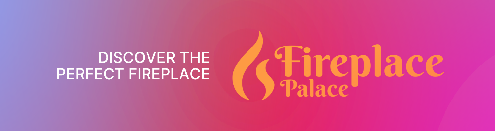

<small>*Click the banner to checkout our app*</small>

## Authors
<a href="https://www.linkedin.com/in/james-hearn-73769493/" style="color: white; text-decoration: underline"><strong>James Hearn</strong></a> · 
**David Macdonald** · 
**Jack White**

## 📋 Contents

- <a href="#-client-brief" style="color: #8962ed; text-decoration: underline;">Client Brief</a>
- <a href="#-solution" style="color: #8962ed; text-decoration: underline;">Solution</a>
- <a href="#-future-scope" style="color: #8962ed; text-decoration: underline;">Future Scope</a>
- <a href="#-dependencies-/-limitations" style="color: #8962ed; text-decoration: underline;">Dependencies / Limitations</a>
- <a href="#-tech-Stack" style="color: #8962ed; text-decoration: underline;">Tech Stack</a>
- <a href="#-lessons-learned" style="color: #8962ed; text-decoration: underline;">Lessons Learned</a>

## ⛔ Client Brief
Our clients "Mike" and "Mandy" came to us with a brief. They wanted a landing page website that would help generate new leads for them in order to find clients who want fireplaces. The initial brief was just a basic outline of a home page with a potential for a consultation booking form. Next, this brief was refined into a website with multiplate pages; Home and About Us. Finally, we were asked to implement a consultation form to help Mike and Mandy collect information for their new leads.

## 🔑 Solution
Our solution was to setup an initial boilerplate in pure HTML and CSS. Upon completing that we presented it to Mike and Mandy and received the go ahead to continue. We immediately set off, porting our HTML and CSS into a react app with Vite. Vite is perfect for setting up quick and easy react apps, with its low-bloat, rapid response setup times. Once completed, we presented our creation to Mike and Mandy for feedback. In typical fashion, our client changed their mind again, but we were ready. They wanted a consultation booking form that could collect potential customer data and store it for later use. To do this, we converted our Vite app to a Next.js application, utilising their directory based routing for pages and layouts, as well as their directory based API routes for handling our form submission api requests. Each POST request would receive the details from the submission form and update the bookingData.json file accordingly.

## 🚀 Future Scope
I would love to have more time working on the front-end design of this website, however, Mike and Mandy only wanted a simple landing page and whilst managing time constraints, we found it unfeasible to take the designs any further. They are mobile responsive, including a nav bar drawer and also work on full-sized devices such as laptops and computers.

## 🪫 Dependencies / Limitations
- API requests are handled by a third party postcode api in order to validate that form field (api.postcodes.io)
- Material UI used to speed up the form design process

## 💽 Tech Stack

### Core
&nbsp;
&nbsp;

### Frontend

&nbsp;
&nbsp;

### Backend & Database

&nbsp;

### Design & Collaboration

&nbsp;

&nbsp;
## ✍️ Lessons Learned

- We found Next.js to be far more efficient and effective to use than vanilla react. The directory based routing allows for cleaner file structure of layouts, pages and components, as well as clean organisation of API routes.
- MaterialUI allowed us to setup the consultation form, which clean and aesthetically pleasing styling and animations, in minutes.
- Using mock data before integrating api's allowed us to setup the front-end quickly.
- Curating a component tree held us accountable for what we were creating and in what order. The component tree gave us a great idea of the Parent and Children components in our app, as well as the data structure and how the data was going to flow down as props.